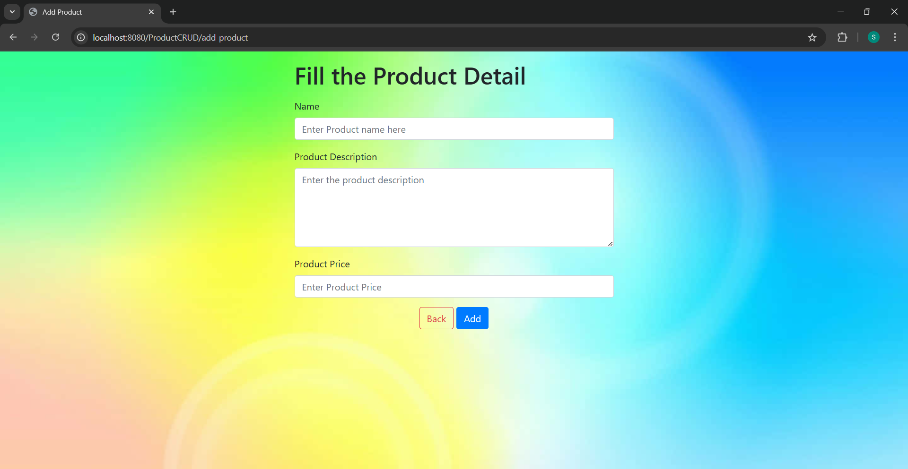
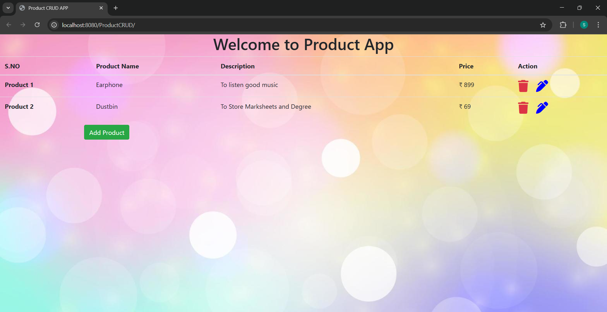
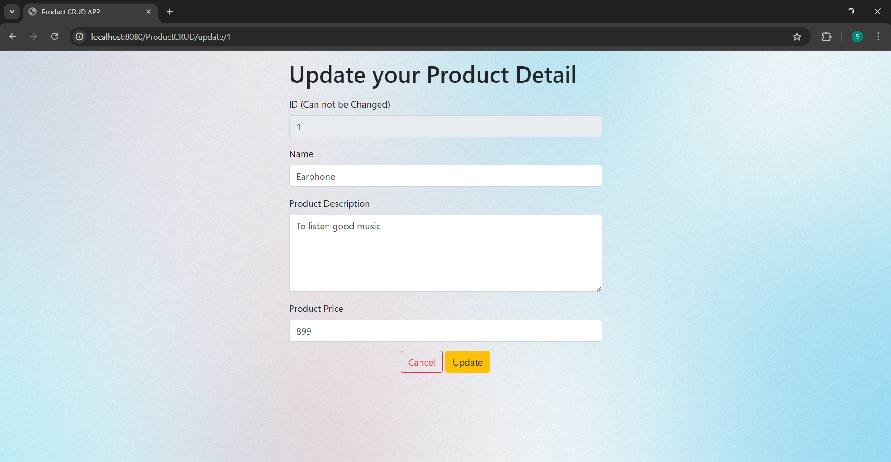

# Product-CRUD-Application-using-Spring-MVC-and-ORM
# 🛒 Product CRUD Application

This is a simple **Spring MVC + Hibernate** web application that performs **CRUD (Create, Read, Update, Delete)** operations on a product database using JSP, Servlet, and MySQL.

---

## 🚀 Features

- Add new product ✅  
- View all products in a table ✅  
- Update existing product details ✅  
- Delete product by ID ✅  
- Background images and styled UI with Bootstrap ✅  

---

## 🛠️ Tech Stack

| Layer           | Technology           |
|----------------|----------------------|
| Backend         | Spring MVC (XML Config) |
| ORM             | Hibernate            |
| View            | JSP + JSTL + Bootstrap |
| Database        | MySQL                |
| Build Tool      | Maven                |
| Server          | Apache Tomcat        |

---

## 🔧 Project Structure

ProductCRUD/
├── src/main/java/ProductCRUD/
│ ├── controller/
│ ├── dao/
│ ├── model/
│ └── AppConfig.java (if annotation-based)
├── src/main/webapp/
│ ├── WEB-INF/
│ │ ├── views/ (JSP files)
│ │ └── resources/ (CSS, JS, images)
├── pom.xml
└── README.md

---

## 🖼️ Screenshots

### ➕ Add Product Page


### 📋 View Products


### ✏️ Update Product



---

## ⚙️ How to Run

### ✅ Prerequisites

- Java 8+
- Apache Maven
- MySQL
- Tomcat 9

### 🔌 Setup Instructions

1. **Clone this repo**
   ```bash
   git clone https://github.com/your-username/ProductCRUD.git
   cd ProductCRUD
